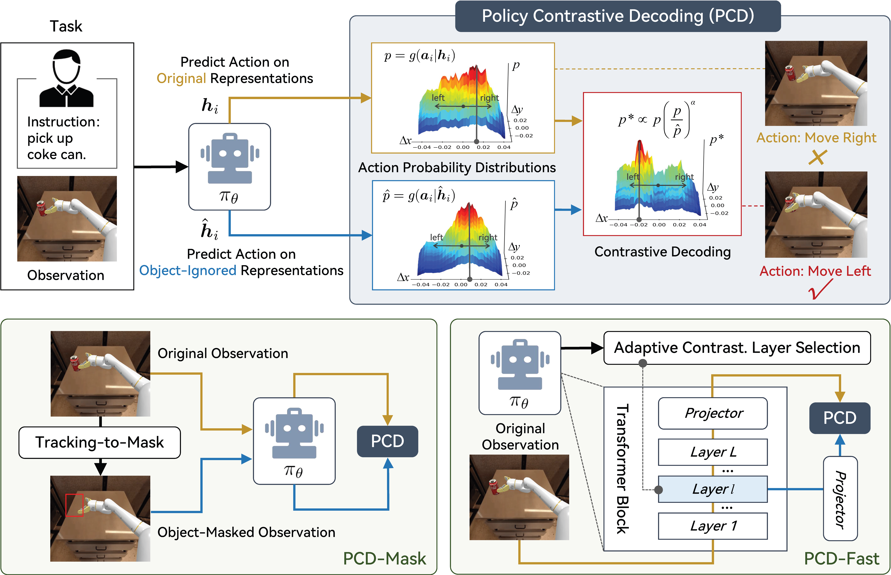
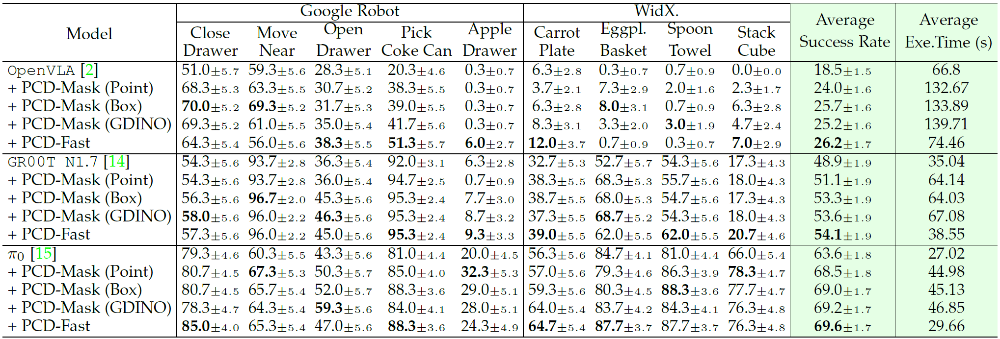
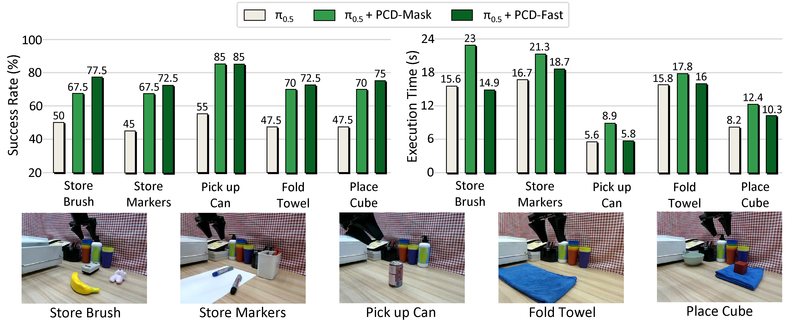
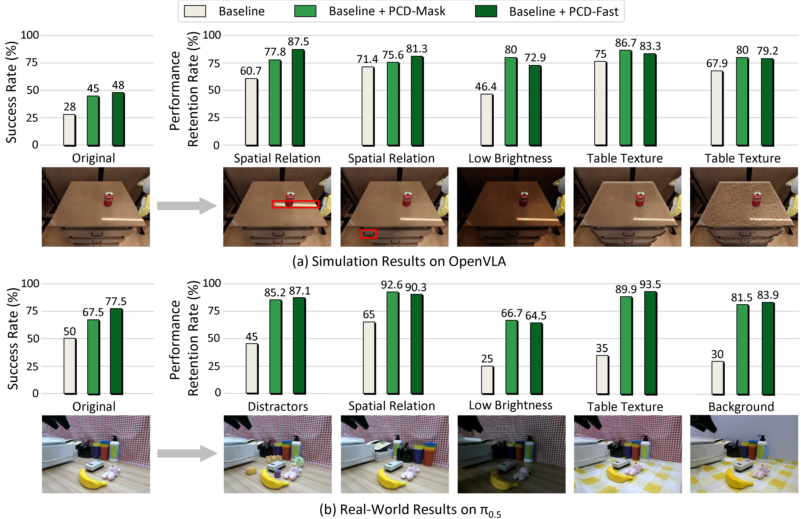

# Mitigating Spurious Correlations in Robotic Foundation Models via Training-free Policy Contrastive Decoding

Official implementation of the paper "Mitigating Spurious Correlations in Robotic Foundation Models via Training-free Policy Contrastive Decoding".

[[Project]](https://eres-lcy.github.io/PCD)


## Introduction

> **Abstract** Robotic foundation models, a.k.a. generalist robot policies, hold immense potential to enable flexible, general-purpose and dexterous robotic systems. 
Despite this, existing robot policies are prone to learning spurious correlations from pre-training trajectories, adversely affecting their generalization capabilities beyond the training data. 
To tackle this, we propose **Policy Contrastive Decoding (PCD)**, a novel framework that redirects the robot policy’s focus toward object-relevant visual cues by contrasting action probability distributions derived from original and object-ignored representations. 
Depending on how the object-ignored representations are constructed, we instantiate PCD in two variants. **PCD-Mask** explicitly masks task-relevant image regions specified by the language instruction and performs contrastive decoding between the action distributions induced by the original and object-masked observations. In contrast, **PCD-Fast** adaptively extracts object-ignored representations from intermediate policy features, eliminating the additional forward pass required by PCD-Mask and achieving a better performance-efficiency trade-off. 
Notably, both variants are training-free and compatible with different types of robot policies. 
Extensive experiments in both simulation and real-world environments on four state-of-the-art policies—including the autoregressive OpenVLA and the flow-matching-based GR00T N1.7, $\pi_{0}$ and $\pi_{0.5}$—validate the flexibility and effectiveness of our PCD framework. 



## Experiments

### Overall Performance

**Simulated Environments**



**Real-world Environments**



### Robustness to Diverse Spurious Correlations



## Videos

Demo videos are available on the [project website](https://eres-lcy.github.io/PCD).

## Running

This release provides three SimplerEnv simulation evaluation pipelines:
OpenVLA, Pi0, and GR00T N1.7. Run the following commands from the repository root.

### 1. Clone the repository

```bash
git clone https://github.com/Eres-lcy/PCD.git
cd PCD
```

### 2. Install dependencies

OpenVLA, Pi0, and GR00T use separate environments because they require
different PyTorch and Python stacks. Install only the policies that you plan to
evaluate. Each script creates its own Conda environment and checks the final
installation.

```bash
# OpenVLA (creates the pcd-openvla environment)
bash scripts/install_dependencies/install_openvla.sh

# Pi0 (creates the pcd-pi0 environment)
bash scripts/install_dependencies/install_pi0.sh

# GR00T client and server (creates pcd-gr00t and the upstream GR00T .venv)
bash scripts/install_dependencies/install_gr00t.sh
```

Activate the matching environment before running an evaluation, for example:

```bash
conda activate pcd-openvla
```

### 3. Download checkpoints

All checkpoints are stored under `checkpoint/`. Downloading does not require
a policy environment; it only requires `hf` (or `huggingface-cli`) to be
available on `PATH`, plus either `curl` or `wget` for the SAM2 checkpoint. The
non-GR00T downloader accepts any combination of `common`, `openvla`, and `pi0`;
with no arguments it downloads all three groups.

```bash
# SAM2, Grounding DINO, and OpenVLA
bash scripts/download_checkpoints/download_pretrained_weights.sh common openvla

# Pi0 policy checkpoints and PaLI-Gemma
bash scripts/download_checkpoints/download_pretrained_weights.sh pi0
```

PaLI-Gemma is gated. Accept its Hugging Face license and run `hf auth login`
before downloading Pi0 if authentication is requested.

GR00T and Cosmos use a separate downloader after the GR00T environment has
been installed:

```bash
third_party/Isaac-GR00T/.venv/bin/hf auth login
bash scripts/download_checkpoints/download_gr00t_models.sh
```

Accept the Hugging Face access terms for `nvidia/Cosmos-Reason2-2B` before
running this command. The two GR00T policy checkpoints are stored under
`checkpoint/gr00t/`, and Cosmos is exposed at
`checkpoint/Cosmos-Reason2-2B`.

#### Big-LaMa

PCD-Mask uses Big-LaMa for the default `lama` inpainting mode. Download the
[`big-lama` folder](https://drive.google.com/drive/folders/1ST0aRbDRZGli0r7OVVOQvXwtadMCuWXg?usp=sharing)
and arrange it as follows:

```text
checkpoint/big-lama/
├── config.yaml
└── models/
    └── best.ckpt
```

Big-LaMa is not required when using `--inpaint-mode telea` or
`--inpaint-mode ns`.

### 4. Run evaluation

Activate the environment for the selected policy, then run one of the launch
scripts. Each launcher evaluates its configured task list; results are written
to `Results/` by default.

```bash
# OpenVLA
conda activate pcd-openvla
bash scripts/inference/openvla_baseline.sh
bash scripts/inference/openvla_pcd_mask.sh
bash scripts/inference/openvla_pcd_fast.sh

# Pi0
conda activate pcd-pi0
bash scripts/inference/pi0_baseline.sh
bash scripts/inference/pi0_pcd_mask.sh
bash scripts/inference/pi0_pcd_fast.sh

# GR00T
conda activate pcd-gr00t
bash scripts/inference/gr00t_baseline.sh
bash scripts/inference/gr00t_pcd_mask.sh
bash scripts/inference/gr00t_pcd_fast.sh
```

The OpenVLA OOD launchers use the same naming convention with an `_ood`
suffix. Common runtime settings can be overridden through environment
variables, for example:

```bash
GPU_DEVICES=0,1 NUM_GPUS=2 N_TRAJS=100 \
    bash scripts/inference/openvla_pcd_fast.sh
```

### Torch compile cache

Pi0 reuses persistent Inductor/Triton artifacts from
`checkpoint/torch_compile_cache/`. Separate subdirectories are selected for
each Python, PyTorch, CUDA, and GPU architecture combination. Set
`TORCHINDUCTOR_CACHE_DIR` to override the cache location.

## Acknowledgements

Our work is built upon the following open-source projects: [SimplerEnv](https://github.com/simpler-env/SimplerEnv), [OpenVLA](https://github.com/openvla/openvla), [Open Pi-0](https://github.com/allenzren/open-pi-zero), [Grounded SAM2](https://github.com/IDEA-Research/Grounded-SAM-2), [YOLO World](https://github.com/AILab-CVC/YOLO-World), [SED](https://github.com/xb534/SED), [Inpaint Anything](https://github.com/geekyutao/Inpaint-Anything).
We thank the authors for releasing their code. If you use our model and code, please consider citing these works as well.

PCD is released under the [Apache License 2.0](LICENSE). Components under
`third_party/` remain subject to their respective upstream licenses.
